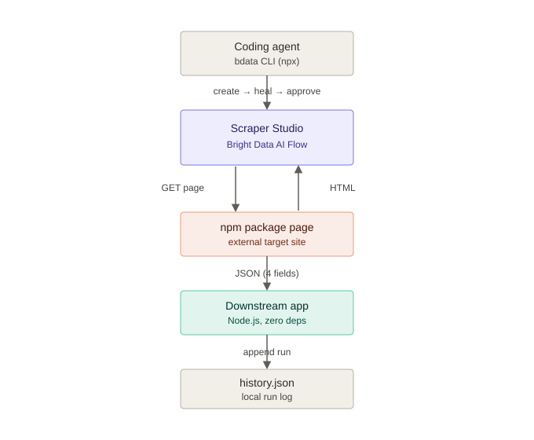

# HealScrape

Self-healing scraper for "Into the Scrape-Verse" (WeMakeDevs + Bright Data hackathon).

Scrapes an npm package page with Bright Data's Scraper Studio, uses `bdata scraper heal`
to patch the scraper when I ask it to grab a new field, and a small Node script consumes
the output.

## Architecture



## Why npm and not itch.io

Originally targeted an itch.io game page. Scraper built fine but every run threw:

```
"error": "Crawler error: tunneling socket could not be established, statusCode=403",
"error_code": "proxy_config"
```

Checked it wasn't my account (ran the same scraper against `example.com`, worked fine;
plain `bdata scrape` on the itch.io URL also worked fine) — itch.io just blocks Bright
Data's Scraper Studio crawler IP range specifically. Switched to npm instead. Full log
of that detour is in [PROGRESS.md](PROGRESS.md) if you want the play-by-play.

## Setup

```bash
npx -p @brightdata/cli bdata login
npx -p @brightdata/cli bdata budget   # should show your $50 credit
cp .env.example .env                  # then fill in BRIGHT_DATA_API_TOKEN + COLLECTOR_ID
```

Get your API token from `brightdata.com/cp/setting/users` ("Show" next to your key).
COLLECTOR_ID for this repo's scraper: `c_mt4kwj0g1s40ktkdcx`.

No npm install needed for the app — plain Node 18+, uses the built-in `fetch`.

## Run it

```bash
npx -p @brightdata/cli bdata scraper run c_mt4kwj0g1s40ktkdcx https://www.npmjs.com/package/is-odd --pretty
node app/run.js
```

`app/run.js` hits the Bright Data API directly (`/dca/trigger_immediate` +
`/dca/get_result`), prints a table, and appends the run to `app/history.json`.

```
HoloScrape — latest scrape result
----------------------------------------------
Package          : is-odd
Version          : 3.0.1
Weekly downloads : 1186373
Last publish     : 8 years ago
----------------------------------------------
```

Sample raw output: [sample-output.json](sample-output.json)

## The self-heal part

Asked it to add a `license` field without touching the collector ID:

```bash
npx -p @brightdata/cli bdata scraper heal c_mt4kwj0g1s40ktkdcx \
  "Also capture the package's license type (e.g. MIT) shown on the page" \
  --url https://www.npmjs.com/package/is-odd --pretty
```

It came back `awaiting_approval` with a preview row that actually had `license: "MIT"`
in it (saved as-is in [heal-preview.json](heal-preview.json)). Approved it, same
collector ID, status flips to `done`:

```bash
npx -p @brightdata/cli bdata scraper approve c_mt4kwj0g1s40ktkdcx --url https://www.npmjs.com/package/is-odd --pretty
```

Where it got annoying: the new field showed up in the approval preview but not
reliably on actual `scraper run` calls afterward — tried a few different fields and
run modes over a few heal attempts, same pattern each time. The original 4 fields
never budged. Didn't want to fake a cleaner recording, so the demo shows the real
approval flow (heal → preview → approve, same collector ID throughout) and is upfront
that live extraction of the new field is flaky on this particular site. Whole trail of
attempts is in PROGRESS.md if you're curious.

## Files

```
app/run.js           downstream script — triggers scraper, prints table, logs history
app/history.json      one entry per run, generated automatically
sample-output.json    real scraper output
heal-preview.json     real heal approval-gate output
docs/architecture.svg
PROGRESS.md            build log / decisions as they happened
```

## Demo video

TBD
